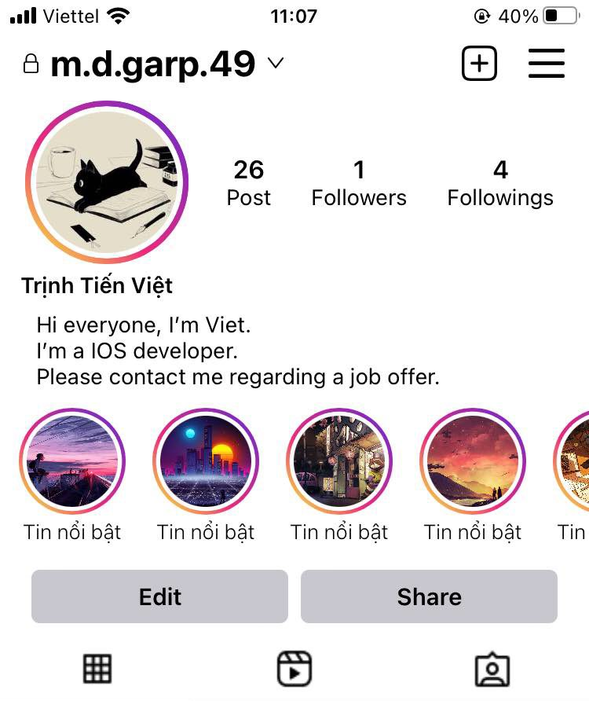
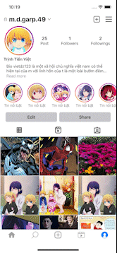
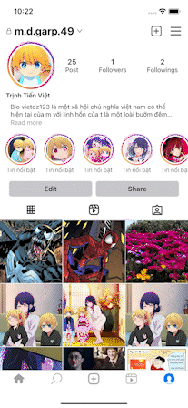
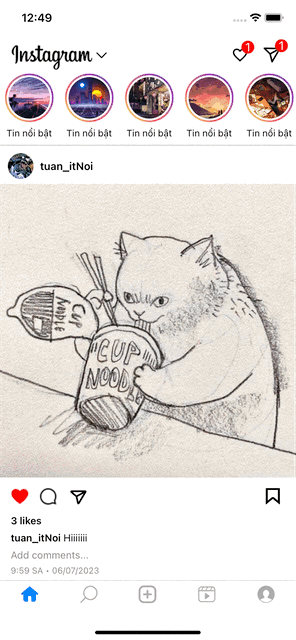
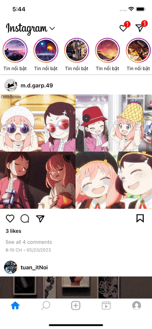
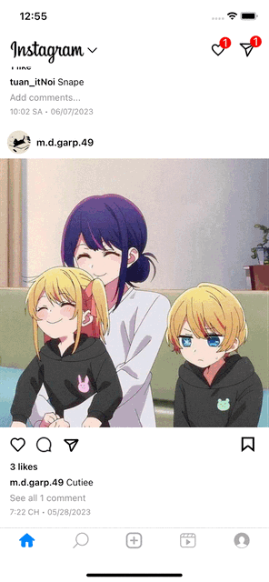
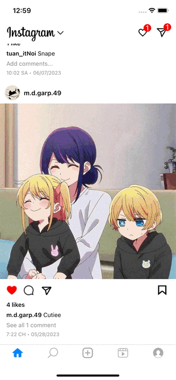
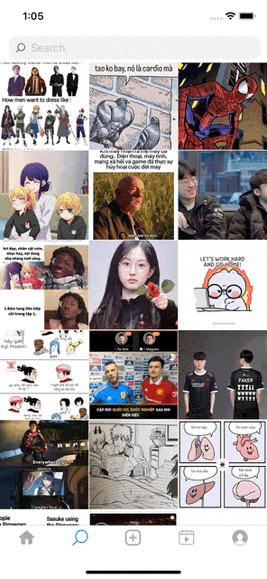

<!-- PROJECT LOGO -->
 

  
  <h3 align="center">Instagram</h3>
  

    This is a personal project aimed at learning and practicing various concepts!
     
    <a href="https://github.com/Vietdz123/Instagram">View Demo</a>
    ·
    <a href="https://github.com/Vietdz123/Instagram/issues">Report Bug</a>
  

<!-- TABLE OF CONTENTS -->

  
Table of Contents

  <ol>
    <li>
      <a href="#about-the-project">About The Project</a>
    </li>
    <li>
      <a href="#getting-started">Getting Started</a>
    </li>
    <li><a href="#video-demo">Video Demo</a></li>
    <li><a href="#contact">Contact</a></li>
  </ol>

<!-- ABOUT THE PROJECT -->
## About The Project

This is a my personal project where  I am trying to emulate the features of Instagram after using them. I have utilized several frameworks and classes, including:
- **UICollectionViewCompositionalLayout**: : To create multiple sections with various layouts and sizes.
- **PhotosKit**: For loading images from the user's photo library.
- **AVFoundation**: For capturing photos.
- **DispathQueue and DispathGroup**: Fetching Data with multiple Threads.
- **UIview.animate(), CGAffineTransform(), UIPanGestureRecognizer()**: Enhancing user experiences.
- **Firebase**: For user authentication and user data storage.

(<a href="#readme-top">back to top</a>)

<!-- GETTING STARTED -->
## Getting Started

Project is builted without Storyboard. 
Architecure: MVVM. 
Instagram have 4 main Controlers:
- ***ProfileConttroller***:  This controller is responsible for editing the user's profile, as well as managing the follow and unfollow actions for other users. Depending on the user's identity and the screen they are presented from, different layouts will be displayed.
- ***HomeController***: This controller is used to display the photo statuses. Users can perform actions such as liking, commenting, and viewing users who have liked a particular status.
- ***UploadStatusController***: From this controller, users can select images from their own photo library or capture new photos to post as statuses.
- ***ExploreController***: This controller is used to showcase other users' statuses and enables searching for other users.

Implementing **HomeController** has been both interesting and challenging. It took me 6 days to complete. To support both vertical and horizontal scrolling, I had to implement two scroll views and two child controllers
-  **HeaderProfileController**: This controller displays user information and handles follow/unfollow actions.
-  **Bottom ProfileController**: BottomProfileController is a controller that contains three child controllers for horizontal scrolling.
-  ContainerScrollView: This scroll view is responsible for containing the views of the two child controllers mentioned above.
-  OverlayScrollView: For scrolling views.
  
In addition, I have also customized a Bottom Sheet Controller for the logout and settings functionality 
 

## Video Demo
### I. ProfileController
Main Feature ProfileController
- Scroll behaves like Instagram: Start at the header profile, then continue scroll to bottom images.

- Custom BottomSheetController and Logout:

- Edit Profile:

- Check followers and followings user:

# II. HomeController
- Dynamic Size Cell:

- Likes and Comments Status:

- Profile of other users:

# III. HomeController
Search and Explore Statues:

# IV. UploadStatusController
Upload Status with caption and photo image.

## Contact

Your Name - [Trinh Tien Viet](https://www.facebook.com/mdgarp49) - tienviet153153@gmail.com

Project Link: [https://github.com/Vietdz123/Instagram.git](https://github.com/Vietdz123/Instagram.git)

(<a href="#readme-top">back to top</a>)

